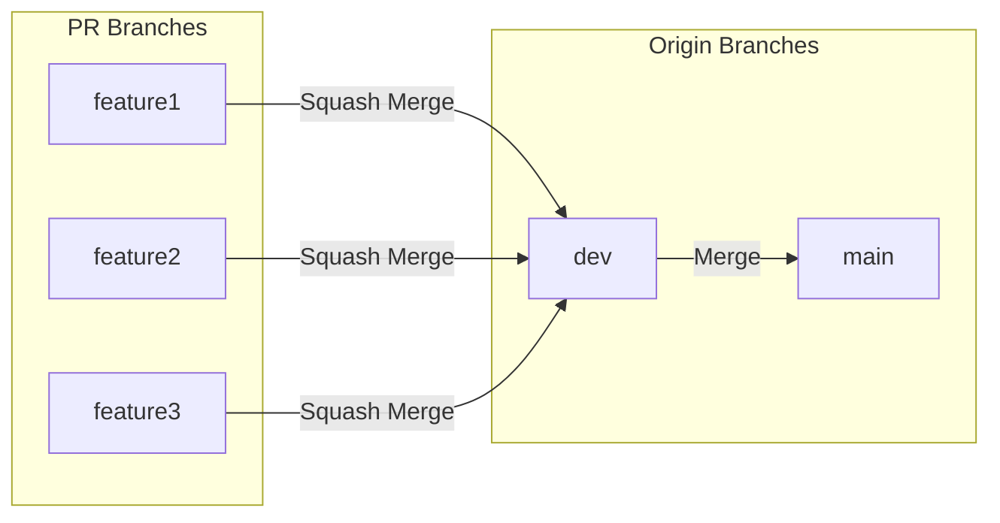

# Contributing Guide<!-- omit in toc -->

> [!NOTE]
> You must follow the [Code of Conduct](./CODE_OF_CONDUCT.md).

I happily welcome your contributions!
Before you contribute,
I would recommend reading this guideline for a better development experience.

<br />

- [💬 Commit Message](#-commit-message)
- [🎋 Pull Requests Branch](#-pull-requests-branch)
- [❓ Pull Requests Title](#-pull-requests-title)
- [🪵 Commit Log](#-commit-log)

<br /><br />

## 💬 Commit Message

I recommend you to follow [Conventional Commits] with this format.

```commit message
type(scope): Description

Body
```

[Conventional Commits]: https://www.conventionalcommits.org

<br />

## 🎋 Pull Requests Branch

I use the [`dev`] branch for the temporary merging.
When it's time to release, I'll merge the [`dev`] branch into the [`main`] branch.
<br />
For this reason, please fork the [`dev`] branch and open a PR to it.

[`main`]: https://github.com/5ouma/opml-generator/tree/main
[`dev`]: https://github.com/5ouma/opml-generator/tree/dev



<br />

## ❓ Pull Requests Title

You don't need to add any prefixes like `feature` or `bug fix`
to the Pull Requests title.
I can recognize what kind of PR it is from labels.
Please give a clear title.

<br />

## 🪵 Commit Log

I do squash merge to the dev branch to keep the commit history clean.
When merging your Pull Request, I'll add the Conventional Commits type and scope.
